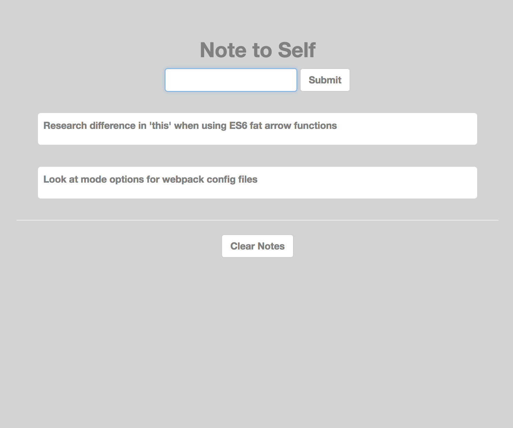

# Note to Self

A single page front-end notes app using React and browser cookies to store reminders so that tasks never get forgotten again. (Yes, very original!)

### Quickstart:
#### How to install the code:
1. Clone this project ```git clone https://github.com/CLTPayne/notetoself.git```
2. Change into the directory ```cd notetoself```
3. Use node version 10.5.0 and have npm installed
4. Run ```npm install``` to add module dependencies

#### How to use the website:
1. Open the server with ```npm start```
2. Your default browser will open the application at localhost:3000
3. When finished with the application, close the server with ```^c```

#### Run Tests:
1. Backend-tests ```npm test```
2. Test coverage of 83%.

#### Application Purpose:
A simple note app which allows the user to store a list of text strings as reminders, via browser cookies. When reminders are complete the user can clear the whole list in one go.

#### Project Goals:
1. Explore React components
2. Learn ES6 and understand why it is so useful in react (anonymous functions like the fat arrow function do not create their own this object and so they are very useful for setting state in the correct context of a component)
3. Explore testing of react components

#### Build Process:
1. Application was created with ```create-react-app```
2. Used ```sfcookies``` module for local storage so that the notes persist
3. React bootstrap was used for simple form elements
4. CSS for basic styling



#### User Stories:
```
As a person learning to code
So that I can remember all the things I want to tackle
I need to store text notes to myself

As a person who gets stuff done
So that I can clear a task when I've completed it
I need to delete all the notes I made
```
